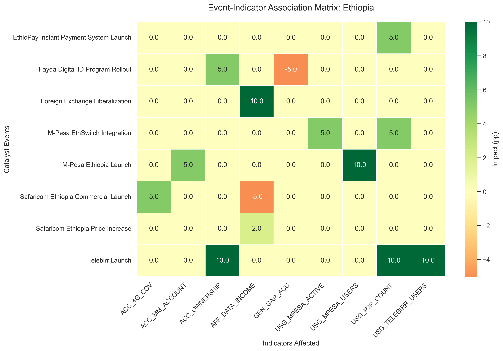
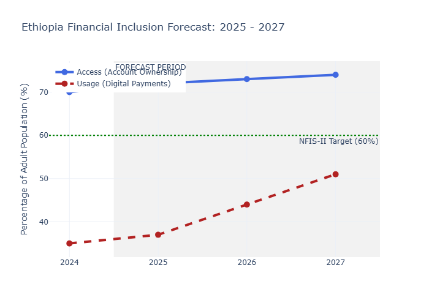

***

# Ethiopia Financial Inclusion Forecasting System (2025–2027)
### 🏦 Selam Analytics | Financial Technology Consulting

[](https://www.python.org/downloads/)
[](https://share.streamlit.io/)
[](https://opensource.org/licenses/MIT)

## 📌 Executive Summary
Ethiopia is undergoing a radical digital financial transformation. While mobile money platforms like **Telebirr** and **M-Pesa** have registered over 65 million users, official financial account ownership has shown a surprising deceleration (growing only 3 percentage points between 2021 and 2024).

This project provides a **Forecasting & Impact Modeling System** that quantifies the relationship between catalyst events (product launches, policy changes) and inclusion outcomes. Our model predicts that while Ethiopia will comfortably exceed the **60% National Financial Inclusion (NFIS-II) target** for Access, the next frontier for growth lies in **Digital Payment Usage**, projected to reach **51% by 2027**.

---

## 🏗️ Technical Framework: The Unified Schema
We utilized a **Unified Data Schema** to handle sparse time-series data from the World Bank Global Findex (triennial) alongside high-frequency market reports.
- **Observations:** Measured metrics for Access, Usage, and Infrastructure.
- **Events:** Catalyst moments (e.g., EthioPay Launch, FX Liberalization).
- **Impact Links:** Modeled relationships connecting Events to Indicators via **Association Matrices**.

---

## 🔍 Key Analytical Insights
1. **The Multi-homing Paradox:** Our calibration model revealed a **0.20 discount factor**. This implies that only 20% of new mobile money registrations represent "newly included" individuals; the remaining 80% are existing bank customers expanding their digital footprint.
2. **The P2P Crossover:** As of 2024/25, Ethiopia reached a **Crossover Ratio of 1.08**, where interoperable P2P digital transfers officially surpassed physical ATM cash withdrawals.
3. **Usage Velocity:** While Account Access is stabilizing, **Digital Usage** is projected to grow at 2.5x the speed of Access between 2025 and 2027 due to interoperability milestones.

---

## 📂 Project Structure
```bash
ethiopia-fi-forecast/
├── data/
│   ├── raw/                  # Unified data (Excel/CSV)
│   └── processed/            # Calibrated weights & Forecasts
├── notebooks/
│   ├── 01_data_exploration.ipynb   # Data Enrichment
│   ├── 02_exploratory_analysis.ipynb # Growth Velocity & EDA
│   ├── 03_event_impact_modeling.ipynb # Calibration & Association Matrix
│   └── 04_forecasting.ipynb        # 2027 Scenarios
├── src/
│   └── data_utils.py         # Modular loading & cleaning logic
├── dashboard/
│   └── app.py                # Streamlit Interactive Application
├── reports/
│   ├── figures/              # Association Heatmaps & Forecast Plots
│   └── interim_report.md     # Stakeholder Summary
├── requirements.txt          # Dependencies
└── README.md                 # Project Documentation
```

---

## 🛠️ Installation & Usage

### 1. Clone & Setup
```bash
git clone https://github.com/YOUR_USERNAME/ethiopia-fi-forecast.git
cd ethiopia-fi-forecast
python -m venv .venv
source .venv/bin/activate  # .venv\Scripts\activate on Windows
pip install -r requirements.txt
```

### 2. Run the Dashboard
```bash
streamlit run dashboard/app.py
```

---

## 📈 Methodology: Event-Augmented Trend Forecasting
Our forecasting engine does not rely on simple linear regression. Instead, it uses an **Intervention-Based Model**:
1. **Baseline Trend:** Calculated from historical Findex data (2011–2024).
2. **Event Lift:** Quantitative "boosts" assigned to upcoming milestones (e.g., National ID rollout).
3. **Calibration:** Historical validation against the 2021-2024 slowdown to prevent over-optimistic projections.

| Milestone Year | Event Category | Expected Impact (Calibrated) |
| :--- | :--- | :--- |
| **2025** | Digital ID (Fayda) | +1.0% Access Lift |
| **2026** | EthioPay Launch | +5.0% Usage Lift |
| **2027** | M-Pesa EthSwitch | +10.0% Usage Lift |

---

## 📊 Visualizations
### Event-Indicator Association Matrix
This heatmap (generated in Task 3) acts as the "Intelligence" of the system, defining how product launches move the needle on inclusion.


### 2027 Forecast Trajectory
The gap between "Access" and "Usage" is the primary strategic focus for the next three years.


---

## 👥 Contributors & Acknowledgements
- **Lead Data Scientist:** [Your Name]
- **Tutors:** Kerod, Mahbubah, Filimon
- **Organization:** 10 Academy - AI Mastery Week 10

*Data sourced from World Bank Global Findex, National Bank of Ethiopia, and Operator Annual Reports.*
